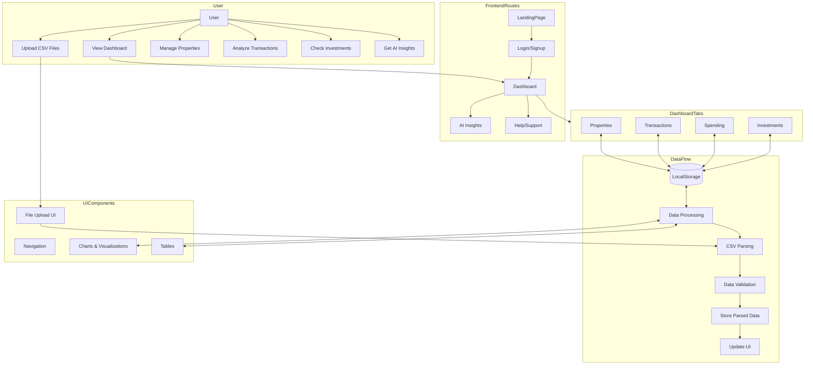
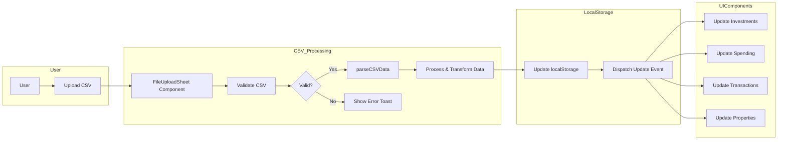
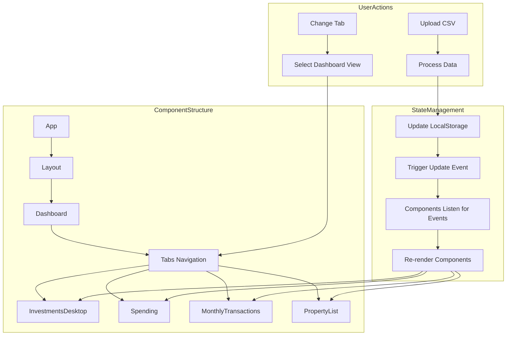
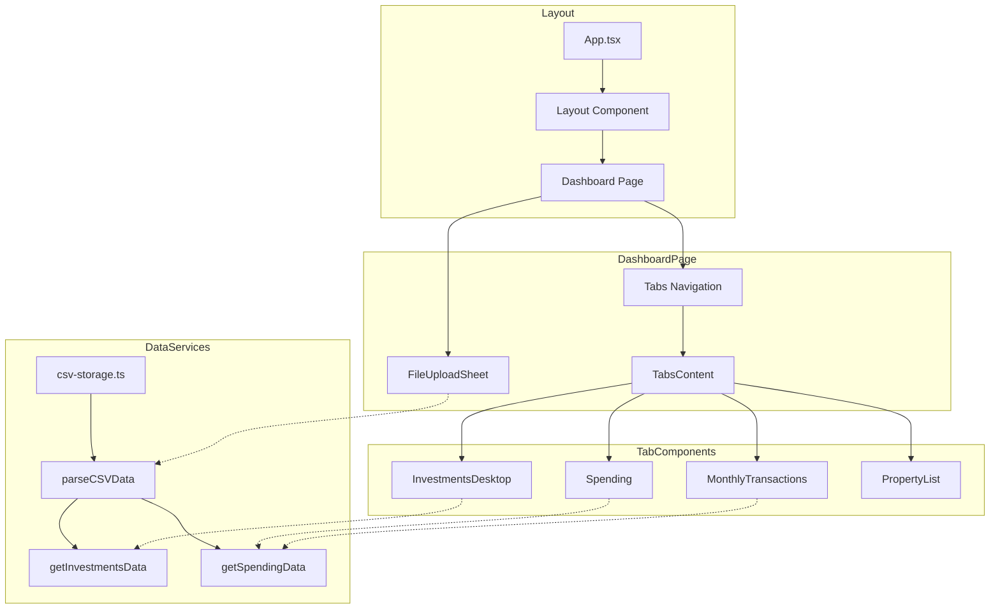
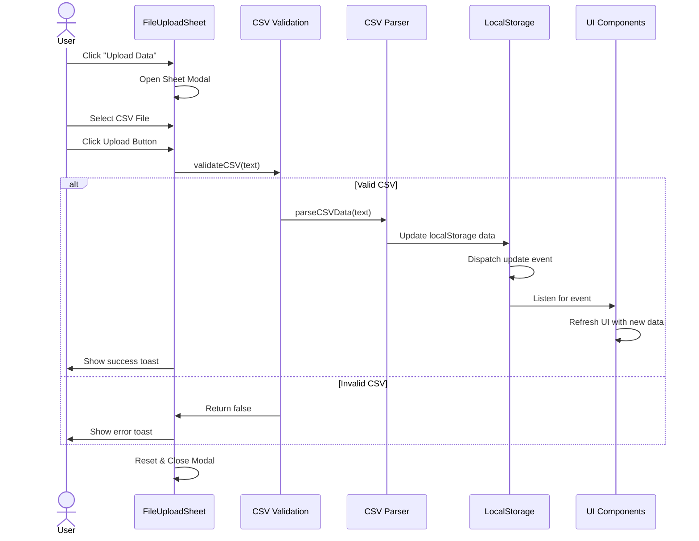
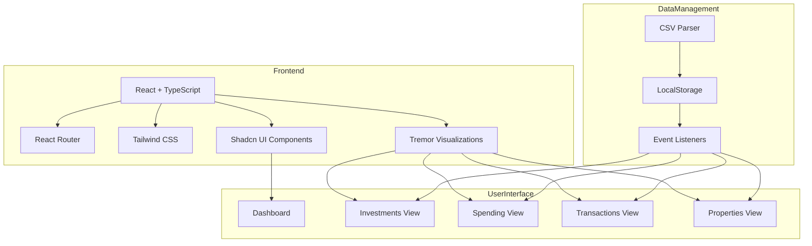

# Financial Insights Application Flow

This document shows the flow of data and user interactions in our Financial Insights application.

## Application Architecture Flowchart

## Data Flow Diagram

## State Management Flow

## Component Interaction Diagram

## File Upload Process

## Technology Stack and Data Flow

The diagrams above illustrate the architecture and flow of the Financial Insights application, showing how data moves from CSV uploads through processing to display in various dashboard components. The application uses local storage for data persistence and leverages React with UI component libraries to create an interactive financial dashboard.
